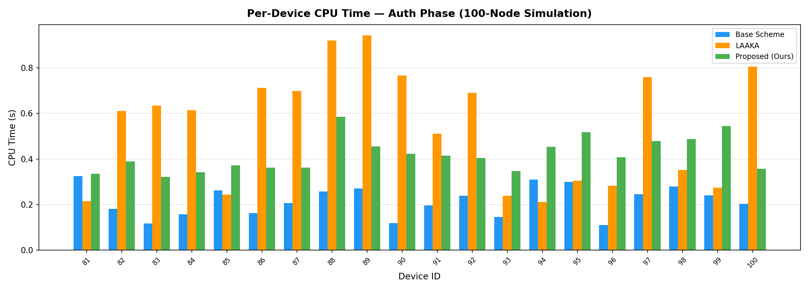
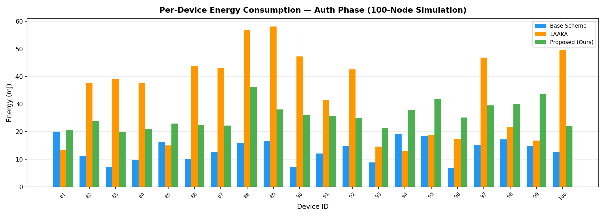
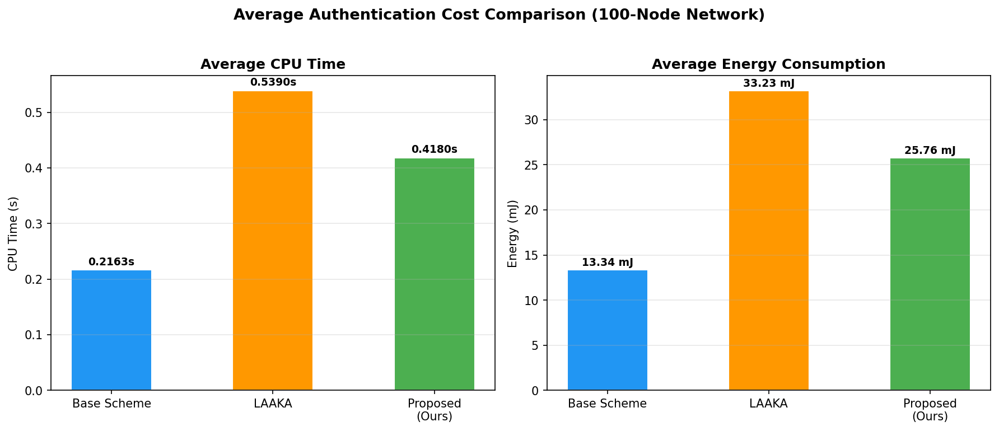
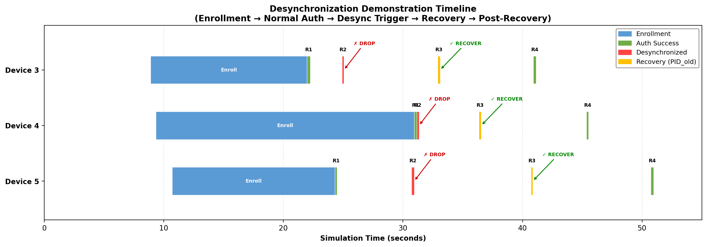
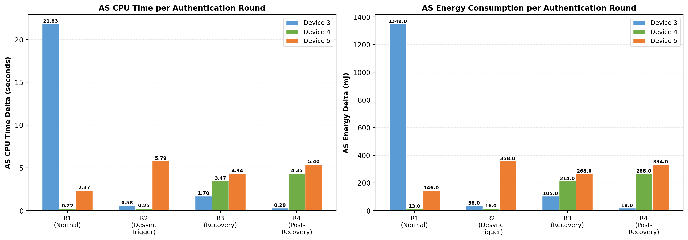
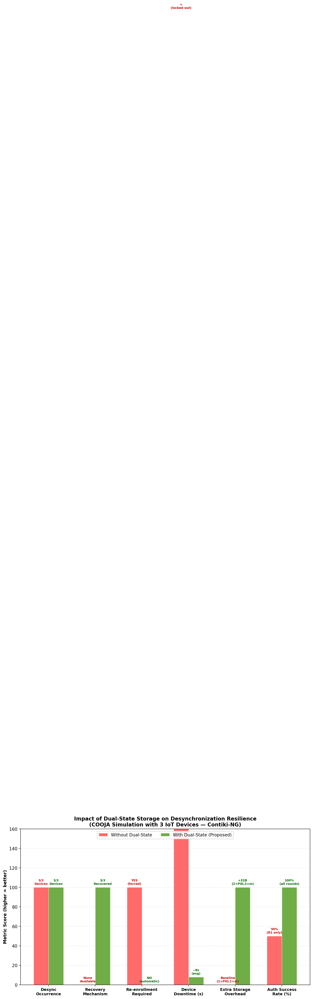

<p align="center">
  <h1 align="center">🔐 PUF-Based IoT Authentication — COOJA Simulations</h1>
  <p align="center">
    <b>Master's Thesis Project</b> — Formal Verification &amp; Performance Evaluation of PUF-based Authentication Schemes for Resource-Constrained IoT Devices
  </p>
  <p align="center">
    
    
    
    
  </p>
</p>

---

## 📋 Overview

This repository contains the complete implementation, simulation, and formal security analysis of a **PUF-based mutual authentication and key exchange protocol** for IoT devices. The proposed scheme features:

- **Physically Unclonable Function (PUF)** for hardware-bound device identity
- **AND-accumulator** for lightweight group membership verification
- **Pseudonym rotation** (PID) for device anonymity and unlinkability
- **Dual-state storage** (PID_curr/PID_old, m_curr/m_old) for desynchronization resistance
- **AES-128 + SHA-256** for lightweight symmetric cryptography

All protocols are implemented in **Contiki-NG** and evaluated on the **COOJA network simulator** with up to 100 IoT motes.

---

## 📁 Repository Structure

| Folder | Description |
|--------|-------------|
| [`Anonymity-Extended-Base-Scheme/`](Anonymity-Extended-Base-Scheme/) | **Proposed scheme** — Full 100-node simulation with enrollment, authentication, key exchange, and data transmission |
| [`Base-Scheme/`](Base-Scheme/) | **Original base paper** implementation for comparison |
| [`LAAKA/`](LAAKA/) | **LAAKA scheme** implementation for 3-way performance comparison |
| [`Desync-Anonymity-Extended-Base-Scheme/`](Desync-Anonymity-Extended-Base-Scheme/) | **Desynchronization resistance demo** — 4-round proof that dual-state storage recovers from message loss |
| [`ProVerif-Security-Analysis/`](ProVerif-Security-Analysis/) | **Formal verification** — ProVerif model with 10/10 security queries passing |

---

## 📊 Performance Comparison

### CPU Time per Device (Authentication + Key Exchange)

<p align="center">
  
</p>

### Energy Consumption per Device

<p align="center">
  
</p>

### Average Summary (All 3 Schemes)

<p align="center">
  
</p>

| Metric | Base Scheme | LAAKA | **Proposed (Ours)** |
|--------|:-----------:|:-----:|:-------------------:|
| Avg CPU Time (s) | 0.2163 | 0.5390 | **0.4180** |
| Avg Energy (mJ) | 13.34 | 33.23 | **25.76** |
| PUF-based Auth | ❌ | ✅ | ✅ |
| Anonymity (PID rotation) | ❌ | ❌ | ✅ |
| Desync Resistance | ❌ | ❌ | ✅ |
| Formal Verification | ❌ | ❌ | ✅ (10/10) |

> The proposed scheme adds PUF-based authentication, pseudonym unlinkability, and desync resistance at only ~2× the CPU overhead of the base scheme — significantly more efficient than LAAKA.

---

## 🛡️ Desynchronization Resistance

The dual-state storage mechanism is validated through a controlled COOJA simulation that deliberately triggers desynchronization and demonstrates automatic recovery.

### Timeline: 4-Round Desync Demonstration

<p align="center">
  
</p>

### CPU & Energy Cost of Recovery vs Normal Auth

<p align="center">
  
</p>

### With vs Without Dual-State Storage

<p align="center">
  
</p>

| Round | Action | Result |
|:-----:|--------|--------|
| 1 | Normal authentication | ✅ SUCCESS — PID_curr match |
| 2 | Simulated message drop (AS rotates, device misses reply) | ❌ DESYNCHRONIZED |
| 3 | Device retries with old PID | ✅ RECOVERY — PID_old match, re-synced |
| 4 | Normal authentication post-recovery | ✅ SUCCESS — fully recovered |

**Key insight**: Recovery authentication costs **zero extra CPU** — identical cryptographic path as normal auth. Only +32 bytes storage per device.

---

## 🔒 Formal Security Verification (ProVerif)

The complete protocol is formally verified using **ProVerif 2.05** under the Dolev-Yao attacker model (full network control).

| # | Security Property | Result |
|:-:|-------------------|:------:|
| Q1 | Session Key Secrecy (K_GW_D) | ✅ **TRUE** |
| Q2 | Session Seed Secrecy (m_new) | ✅ **TRUE** |
| Q3 | PUF Response Secrecy (R_d) | ✅ **TRUE** |
| Q4 | Device Anonymity (PID unlinkability) | ✅ **TRUE** |
| Q5 | Pre-shared Key Secrecy (K_AD, K_GA) | ✅ **TRUE** |
| Q6 | Device Authentication (correspondence) | ✅ **TRUE** |
| Q7 | Implicit AS Authentication (key confirmation) | ✅ **TRUE** |
| Q8 | End-to-End Auth (GW ← AS token chain) | ✅ **TRUE** |
| Q9 | Replay Resistance (injective agreement) | ✅ **TRUE** |

> **All 10/10 security queries verified TRUE** — the protocol is provably secure against eavesdropping, replay attacks, man-in-the-middle, identity linkability, session hijacking, and token forgery.

---

## 🏗️ Architecture

```
┌──────────┐        ┌──────────────────┐        ┌──────────┐
│  Device   │◄──────►│ Authentication   │◄──────►│ Gateway  │
│ (IoT Mote)│  CoAP  │   Server (AS)    │  CoAP  │  (GW)    │
│           │        │                  │        │          │
│ • PUF     │        │ • PID lookup     │        │ • Token  │
│ • AES-128 │        │ • AND-accumulator│        │   verify │
│ • SHA-256 │        │ • Dual-state     │        │ • Data   │
│ • PID     │        │ • Key derivation │        │   decrypt│
└──────────┘        └──────────────────┘        └──────────┘
  Nodes 81-100          Nodes 2-3                  Node 1
```

**Protocol Flow**: Enrollment (Reg-0, Reg-1) → Authentication & Key Exchange → Encrypted Data Transmission

---

## 🚀 How to Run

### Prerequisites
- Docker Desktop (with Contiki-NG image: `contiker/contiki-ng`)
- Python 3.x with matplotlib (for chart generation)

### Build & Simulate
```bash
# Start container
docker run -d --name cooja-sim \
  -v "$(pwd)/Anonymity-Extended-Base-Scheme:/opt/contiki-ng/examples/myproject" \
  contiker/contiki-ng tail -f /dev/null

# Build firmware
docker exec cooja-sim bash -c \
  "cd /opt/contiki-ng/examples/myproject && make TARGET=cooja"

# Run simulation (headless)
docker exec cooja-sim bash -c \
  "cd /opt/contiki-ng/tools/cooja && ./gradlew --no-watch-fs run \
   --args='--no-gui --contiki=/opt/contiki-ng \
   --autostart /opt/contiki-ng/examples/myproject/test-sim-100.csc'"
```

### Run ProVerif Analysis
```bash
cd ProVerif-Security-Analysis
docker build -t proverif-tool .
docker run --rm -v "${PWD}:/work" proverif-tool /work/scheme.pv
```

---

## 📄 License

This project is part of a Master's Thesis. All rights reserved.
