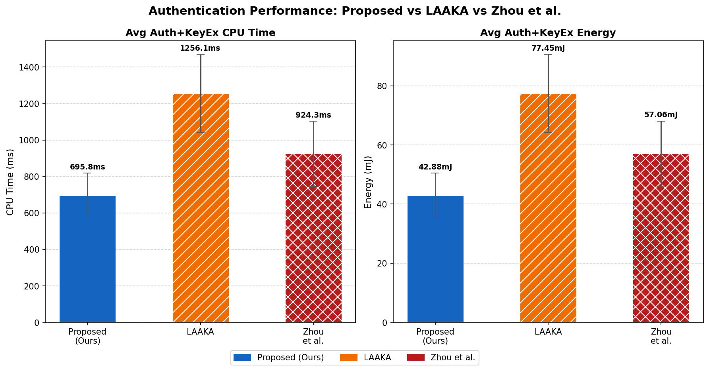
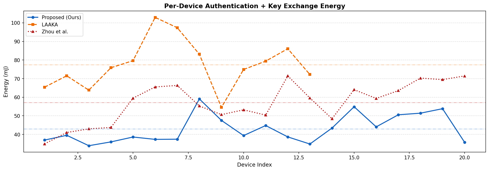
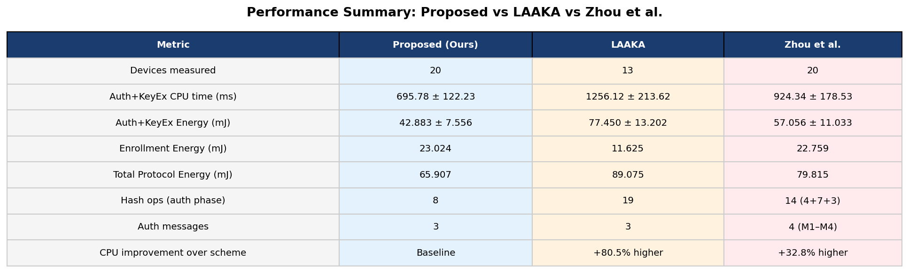
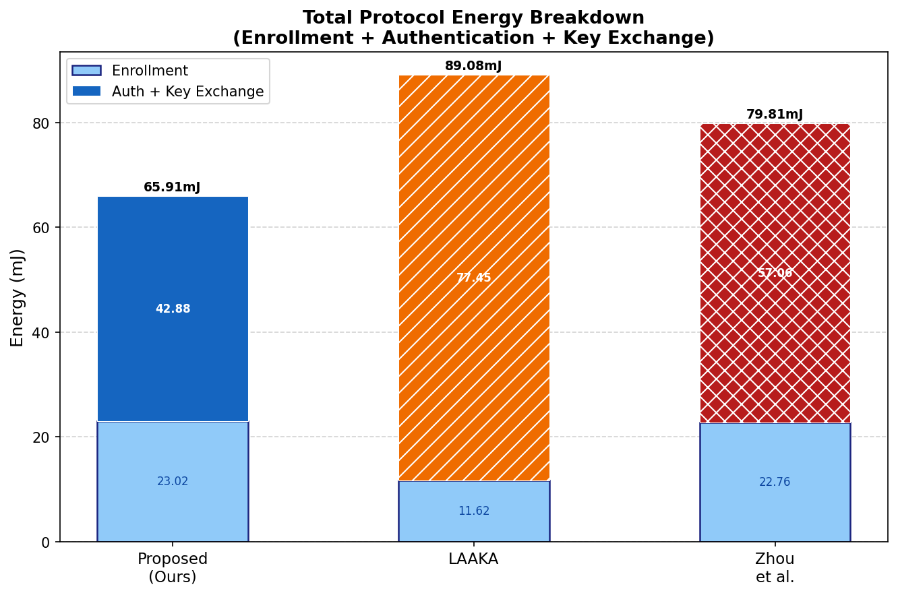
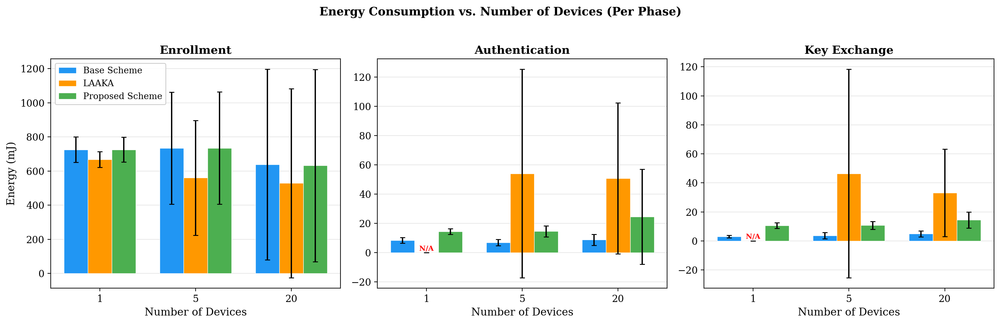
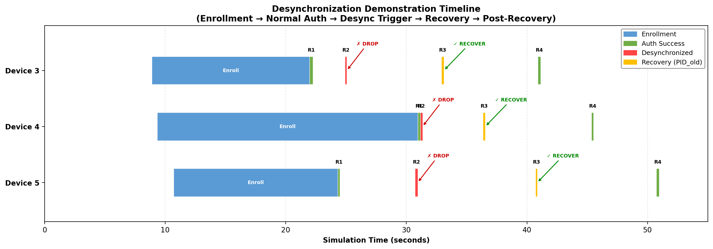

# PUF-Based Lightweight Anonymous Authentication for Constrained IoT Networks

Master's Thesis Project — formal design, COOJA simulation, and performance evaluation of a lightweight PUF-based authentication scheme with anonymity and desynchronization resilience for multi-hop IoT networks.

---

## Proposed Scheme

### What it does

The proposed scheme authenticates resource-constrained IoT devices through a distributed **Authentication Server (AS)** — any node authorized by the gateway — rather than relying on the gateway alone. It adds **device anonymity**, **session unlinkability**, and **desynchronization recovery** on top of the base PUF-based scheme, with minimal additional computation.

### Core mechanisms

| Mechanism | Description |
|-----------|-------------|
| **PUF binding** | `Φ = R_AS ⊕ R_D` stored at enrollment; used to recover device secret without transmitting it |
| **Hash accumulator** | `T_acc &= H(y)` — O(1) membership check without per-device lookup table |
| **Rotating pseudonyms** | `PID = H(ID ‖ m)` updated every session; device is unlinkable across authentications |
| **Session masks** | Fresh random `m_new` rotated after each auth; prevents replay and interception |
| **Dual-state recovery** | Both current and previous `(PID, m)` stored; AS recovers from dropped/reordered messages |

### Protocol phases

```
Device (D)                    Auth Server (AS)                  Gateway (GW)
   |                               |                                |
   |── Enrollment ──────────────>  |                                |
   |   H(y) into T_acc             |                                |
   |   PUF binding Φ = R_AS⊕R_D   |                                |
   |                               |                                |
   |── Auth: PID‖Y⊕mask‖ts₁ ───> |  (65 bytes, 3-msg round)       |
   |          [Hash 1–4, AES×2]   |  Verify T_acc & Y == T_acc     |
   |                               |  Recover Y via Φ               |
   |                               |                                |
   |<── m_new (masked) ────────── |── enc token ─────────────────> |
   |    K = H(R_D ‖ m_new)        |   K_GW-D derived by AS         |
   |                               |                                |
   |── SE(K_GW-D, data) ─────────────────────────────────────────> |
```

### Security properties

| Property | Proposed | Base Scheme | LAAKA | Zhou et al. |
|----------|:--------:|:-----------:|:-----:|:-----------:|
| Replay resistance | ✓ | ✓ | ✓ | ✓ |
| MITM resistance | ✓ | ✓ | ✓ | ✓ |
| Device anonymity | ✓ | ✗ | ✓ | ✓ |
| Session unlinkability | ✓ | ✗ | ✓ | ✓ |
| Desync recovery | ✓ | ✗ | ✗ | ✓ |
| Forward secrecy | ✓ | ✗ | ✓ | ✓ |
| Physical capture resistance | ✓ | Partial | ✓ | ✓ |
| RA-independent ongoing auth | ✓ | ✗ | ✓ | ✗ |

---

## Performance Comparison

All results from 100-node COOJA simulations (20 active devices, 1800 s, seed 123456) using Contiki-NG on simulated sky motes (3.0 V, CPU 1.8 mA, TX 17.4 mA, RX 18.8 mA).

### Authentication + Key Exchange cost (per device, averaged over 20 devices)

| Scheme | Avg CPU Time | Avg Energy | Hash ops | Auth messages |
|--------|:------------:|:----------:|:--------:|:-------------:|
| **Proposed (Ours)** | **695.8 ms** | **42.88 mJ** | **8** | **3** |
| LAAKA | 1256.1 ms | 77.45 mJ | 19 | 3 |
| Zhou et al. | 924.3 ms | 57.06 mJ | 14 (4+7+3) | 4 (M1–M4) |

> Proposed scheme is **44.6 % faster** and uses **44.6 % less energy** than LAAKA, and **24.7 % faster** with **24.8 % less energy** than Zhou et al., while providing equivalent or superior security properties.

### Enrollment cost (per device)

| Scheme | Avg CPU Time | Avg Energy |
|--------|:------------:|:----------:|
| **Proposed (Ours)** | **373.5 ms** | **23.02 mJ** |
| Base Scheme | 424.9 ms | 26.21 mJ |
| LAAKA | 209.0 ms | 12.88 mJ |

### Additional cost over the Base Scheme

The base scheme provides no anonymity, no pseudonym rotation, no desync recovery, and no forward secrecy. The proposed scheme adds all four at the following incremental cost:

| Phase | Base | Proposed | Overhead |
|-------|:----:|:--------:|:--------:|
| Auth + Key Exchange (CPU) | 399.0 ms | 695.8 ms | **+74.4 %** |
| Auth + Key Exchange (Energy) | 24.61 mJ | 42.88 mJ | **+74.2 %** |
| Enrollment (CPU) | 424.9 ms | 373.5 ms | **−12.1 %** (lower) |
| Enrollment (Energy) | 26.21 mJ | 23.02 mJ | **−12.2 %** (lower) |

The ~74 % auth overhead buys four major security upgrades — anonymity, unlinkability, desync recovery, and forward secrecy — that make the scheme competitive with or superior to LAAKA and Zhou et al. at significantly lower cost.

### Charts

**Auth + KeyEx energy and CPU time — Proposed vs LAAKA vs Zhou et al.**



**Per-device breakdown across all 20 devices**



**Summary comparison table**



**Full protocol stacked cost (Enroll + Auth + KeyEx)**



**Scalability — energy per phase vs network size**



**Desynchronization recovery timeline**



---

## Repository Structure

| Path | Contents |
|------|----------|
| `Anonymity-Extended-Base-Scheme/` | Proposed scheme source (`device-node.c`, `as-node.c`, `gw-node.c`), simulation files, full paper docx |
| `Base-Scheme/` | Reference base scheme implementation |
| `Base-Scheme-Aligned/` | Fair-comparison variant with matched message structure |
| `LAAKA/` | LAAKA scheme (Ali & Ahmed, *Computers & Security* 2024) |
| `Zhou-Scheme/` | Zhou et al. (IEEE IoT Journal 2024) — fixed simulation with repeated auth rounds |
| `Desync-Anonymity-Extended-Base-Scheme/` | Desync resilience experiment |
| `Proposed-Scheme-Two-Round/` | Two-round variant study |
| `Hardware/` | Laptop + Raspberry Pi native deployment with pypuf |
| `Results/CSV-Data/` | Per-scheme CSV outputs (auth, enroll, keyex, comparison) |
| `Results/Charts/` | Final comparison charts (20 canonical charts across 4 folders) |
| `Scripts/` | Simulation runners, metric extractors, chart generators |
| `ProVerif-Security-Analysis/` | Formal security models and ProVerif output |

### Results/Charts layout

```
Results/Charts/
├── 02-Final-Three-Scheme-Comparison/   # 5 charts — energy, CPU, stacked, compute-only, table
├── 03-Desync-Analysis/                 # 3 charts — desync timeline, CPU/energy, comparison
├── 03-Zhou-vs-LAAKA-vs-Proposed-Final/ # 4 charts — 3-scheme comparison with fixed Zhou results
└── 04-Scalability/                     # 6 charts — per-phase, stacked, theoretical, summary
```

---

## Build and Run (Docker + COOJA)

```powershell
# Mount workspace and start container
docker run -d --name cooja-sim `
  -v "C:\ANUP\MTP\Proposing\Codes For COOJA:/mnt/schemes" `
  contiker/contiki-ng tail -f /dev/null

# Build proposed scheme firmware
docker exec cooja-sim bash -c `
  "cd /mnt/schemes/Anonymity-Extended-Base-Scheme && make CONTIKI=/home/user/contiki-ng TARGET=cooja"

# Run 100-node simulation (headless)
docker exec cooja-sim bash -c `
  "cd /home/user/contiki-ng/tools/cooja && ./gradlew --no-watch-fs run \
   --args='--no-gui --contiki=/home/user/contiki-ng \
   --autostart /mnt/schemes/Anonymity-Extended-Base-Scheme/test-sim-100.csc'"
```

Same pattern applies to `LAAKA/`, `Zhou-Scheme/`, and other scheme folders.

---

## Formal Verification (ProVerif)

```powershell
cd ProVerif-Security-Analysis
docker build -t proverif-tool .
docker run --rm -v "${PWD}:/work" proverif-tool /work/Anonymity_Extended_Scheme.pv
```

Verified properties: secrecy of session key, device anonymity (pseudonym unlinkability), authentication agreement, and replay resistance.

---

## Hardware Deployment (Laptop + 2× RPi)

```bash
# Configure node roles
vim Hardware/config/roles.env   # set GW_HOST, AS_HOST, NODE_HOST

# Run gateway + AS on laptop
python3 Hardware/native/gw_hw.py &
python3 Hardware/native/as_hw.py &

# Run device on RPi
python3 Hardware/native/node_hw.py
```

Requires `pypuf` for real PUF challenge-response. See `Hardware/README.md` for full setup.

---

## License

Academic use — Master's Thesis Project (MTP). Reuse should follow your institutional and publication policies.
