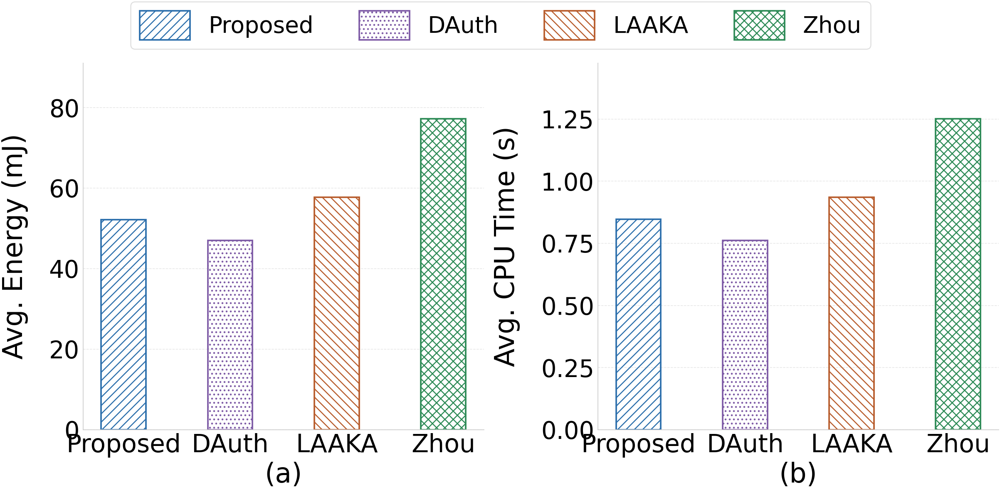
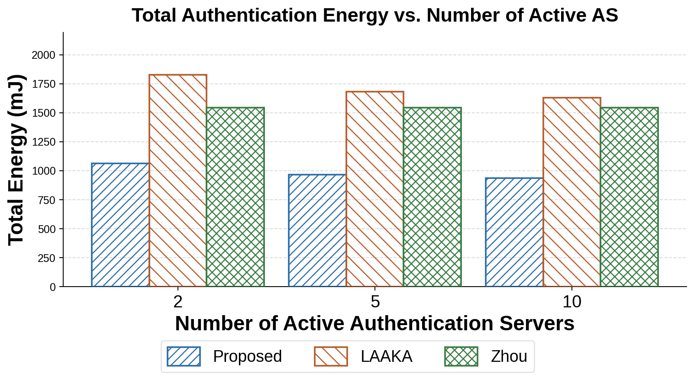
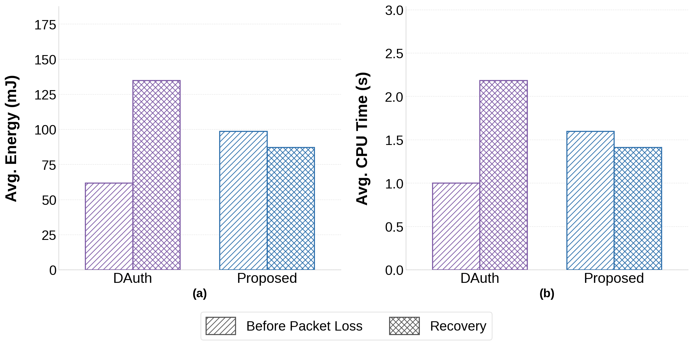

# Anonymity Preserving and Recoverable Distributed Authentication for Multihop IoT Networks

Master's Thesis Project (MTP) — formal design, COOJA simulation, and hardware evaluation of a **lightweight, anonymous, and decoupled distributed authentication** scheme with **desynchronization recovery** for multihop IoT networks.

**Authors:** Sreeparna Das, Anup Kulkarni, Manas Khatua — *Computer Science and Engineering, Indian Institute of Technology Guwahati.*

---

## Overview

The scheme authenticates resource-constrained IoT devices through a **gateway-selected Authentication Server (AS)** — any capable node, parent or non-parent — instead of relying on the gateway alone (a *decoupled, distributed* design). It builds on the base scheme **DAuth** (Das & Khatua, COMSNETS 2026) and closes two gaps in it:

1. **Anonymity via pseudonym rotation.** The real device identity `ID_D` is never sent on the open channel. A rotating pseudonym `PID = H(ID_D ‖ m_curr)` is used and refreshed after each successful key exchange, so the device is unlinkable across sessions and the gateway never learns `ID_D`.
2. **Dual-state desynchronization recovery.** Both AS and device track current and previous state `(m_curr, m_old, PID_curr, PID_old)`. If a device misses a Phase-3 update packet, it re-appears under `PID_old`; the AS recognizes it via the dual-state lookup and re-synchronizes **without re-enrolment**.

These are added on top of the base scheme's PUF-based secret derivation and hash-based one-way accumulator for group-membership verification, at negligible extra cost.

### Compared schemes (do not conflate)

| Label | Scheme |
|-------|--------|
| **Proposed** | This work |
| **DAuth** | Base/predecessor — Das & Khatua, *Decoupled Distributed Authentication*, COMSNETS 2026 |
| **LAAKA** | Ali & Ahmed, *LAAKA*, **Computers & Security** 140 (2024) — a separate scheme, **not** DAuth |
| **Zhou et al.** | Zhou et al., *Security-Enhanced … User Authentication for IoT-Based Healthcare*, **IEEE IoT Journal** 11(6), 2024 |

---

## Protocol phases

```
Device (D)                    Auth Server (AS)                  Gateway (GW)
   |                               |                                |
   |── Enrollment (secure) ─────>  |                                |
   |   y_D enrolled into T_acc     |  store Φ = R_AS ⊕ R_D          |
   |   D stores {y_D, c_D, m_curr} |  init dual state (PID, m)      |
   |                               |                                |
   |── Auth: PID ‖ Y⊕mask ‖ ts₁ ─>|  membership: T_acc & H(y)==T_acc|
   |          [hash + XOR + AES]   |  recover R_D via Φ              |
   |                               |                                |
   |<── m_new (masked), ts₂ ────── |── enc auth token ────────────> |
   |    SK = H(R_D ‖ m_new)        |   K_GW-D derived by AS          |
   |    PID ← H(ID_D ‖ m_new)      |   GW stores PID_curr (not ID_D) |
   |                               |                                |
   |── SE(K_GW-D, data) ─────────────────────────────────────────> |
```

Four phases: **Enrollment → Authentication → Key Exchange → Data Communication.**

---

## Feature comparison (paper Table — *Features Comparison of Authentication Schemes*)

| Feature | Proposed | DAuth | LAAKA | Zhou et al. |
|---|:--:|:--:|:--:|:--:|
| Decoupled (gateway-selected AS) | ✓ | ✓ | ✗ | ✗ |
| PUF-based (no stored long-term key) | ✓ | ✓ | ✗ | ✓ |
| Hash-based accumulator | ✓ | ✓ | ✗ | ✗ |
| Authentication-secret update | ✓ | ✓ | ✓ | ✓ |
| Anonymity | ✓ | ✗ | ✓ | ✓ |
| Desynchronization recovery | ✓ | ✗ | ✗ | ✗ |
| Computation overhead | Low | Low | Low | High |
| Message overhead | Low | Low | Low | Medium |

The proposed scheme is the only one satisfying all criteria simultaneously while keeping the lowest overhead among the anonymity-preserving schemes.

---

## Performance

### COOJA simulation setup

| Parameter | Value |
|---|---|
| OS / Mote | Contiki-NG / Cooja Mote |
| Network size | 100 nodes (20 newly-joined devices, 1 gateway/root, 2 AS) |
| Propagation | UDGM (distance loss) |
| App / Net / MAC | CoAP / RPL Lite / CSMA (IEEE 802.15.4) |
| Simulation time | 75 s, averaged over **10 seeds** |

### Per-device total cost (Enroll + Auth + Key Exchange), N = 100, 2 AS

| Scheme | Energy (mJ) | vs Proposed |
|--------|:-----------:|:-----------:|
| DAuth | 48.08 | −7.9 % (non-anonymous baseline) |
| **Proposed** | **52.19** | — |
| LAAKA | 57.68 | +10.5 % |
| Zhou et al. | 77.25 | +48.0 % |

> The proposed scheme reduces per-device **energy and CPU time by 9.5 % vs LAAKA and 32.4 % vs Zhou et al.** DAuth (no anonymity) sits 7.9 % below Proposed — this gap is the price of provable anonymity. Ordering on both COOJA and hardware: **DAuth < Proposed < LAAKA < Zhou.**

### Hardware (Raspberry Pi 4B, MIRACL Core, NIST P-256) — Authentication + Key Exchange per round

| Scheme | Energy (J) | CPU Time (s) |
|--------|:----------:|:------------:|
| DAuth | 0.0611 | 0.0161 |
| **Proposed** | **0.0617** | **0.0162** |
| LAAKA | 0.0959 | 0.0253 |
| Zhou et al. | 0.1074 | 0.0282 |

> Proposed ≈ DAuth (< 1 % difference — anonymity adds no measurable cost), while both are **~36 % below LAAKA** and **~43 % below Zhou et al.** Energy = wall-clock time × 3.8 W; median of 7 runs, warm-up discarded.

### Desynchronization recovery (per device, 100-node RPL network, 20 devices, 5 seeds)

DAuth single-states the session nonce and must **re-enrol** after a lost Phase-3 packet; the proposed dual-state lookup recovers with a single re-authentication and key exchange. Result: the proposed scheme cuts per-device recovery **energy and CPU time by 35.3 % over DAuth**. (LAAKA and Zhou et al. each retain their previous identifier and self-correct, so they are excluded from this controlled comparison.)

### Charts

**Per-device mean total cost — energy (a) and CPU time (b), 10 seeds, 4 schemes**



**Total energy vs number of active authentication servers**



**Total energy vs network size (N = 30…120, 20 % newly-joined devices)**


**Hardware — Auth + KeyEx energy (a) and CPU time (b), RPi 4B / MIRACL Core**


**Desynchronization recovery cost — Proposed vs DAuth**



---

## Repository structure

| Path | Contents |
|------|----------|
| `Paper/` | LaTeX source (`paper_revised_anonymity.tex`) and figures |
| `Manual-COOJA/` | Per-scheme COOJA sources: `Proposed/`, `DAuth-COOJA/`, `LAAKA/`, `Zhou/` |
| `Revised-Anonymity/` | Proposed-scheme evaluation sources & sweeps (AS variation, network sizes N10–N120, desync demo, `Src-DAuth/`) |
| `Base-Scheme/` | DAuth (base) reference + COMSNETS 2026 PDF |
| `LAAKA/` | LAAKA scheme (`as-node.c`, `device-node.c`, `gw-node.c`) + paper PDF |
| `Zhou-Scheme/` | Zhou et al. scheme (`user-node.c`, `gw-node.c`, `sn-node.c`) + paper PDF |
| `Hardware/MIRACLE/` | **Authoritative** hardware measurements (RPi 4B, MIRACL Core) + plot scripts |
| `Results/COOJA-Simulation/` | Simulation outputs and charts (10-seed comparison, AS/network variation, desync) |
| `Scripts/` | `Simulation-Runners/` and `Utilities/` (runners, metric extractors, chart generators) |
| `ProVerif-Security-Analysis/` | ProVerif model (`Revised_Anonymity_Scheme.pv`) and verification output |
| `Diagrams/` | Protocol phase diagrams |

---

## Build and run (Docker + COOJA)

```bash
# Start the Contiki-NG container with the repo mounted
docker run -d --name cooja-sim \
  -v "$(pwd):/mnt/schemes" \
  contiker/contiki-ng tail -f /dev/null

# Build a scheme's firmware (e.g. the proposed scheme)
docker exec cooja-sim bash -c \
  "cd /mnt/schemes/Manual-COOJA/Proposed && make CONTIKI=/home/user/contiki-ng TARGET=cooja"

# Run a 100-node simulation headless
docker exec cooja-sim bash -c \
  "cd /home/user/contiki-ng/tools/cooja && ./gradlew --no-watch-fs run \
   --args='--no-gui --contiki=/home/user/contiki-ng \
   --autostart /mnt/schemes/Manual-COOJA/Proposed/simulation.csc'"
```

The same pattern applies to `Manual-COOJA/{DAuth-COOJA,LAAKA,Zhou}` and the sweep sources under `Revised-Anonymity/`. Multi-seed sweeps and chart generation are driven from `Scripts/Simulation-Runners/`.

---

## Formal verification (ProVerif)

Model: `ProVerif-Security-Analysis/Revised_Anonymity_Scheme.pv` (ProVerif 2.x, Dolev–Yao adversary). **All 10 queries are satisfied:** injective authentication correspondences (enrolment, authentication, key-exchange binding), session-key secrecy (device and gateway views), `m_new` forward secrecy, `ID_D` anonymity, and offline-guessing resistance of `K_GW-D`.

```bash
cd ProVerif-Security-Analysis
proverif Revised_Anonymity_Scheme.pv
```

---

## Hardware deployment (laptop gateway + 2× Raspberry Pi 4B)

Two RPi 4B boards act as the IoT device and the authentication server / fog node; a laptop serves as the gateway. All hash, AES, and elliptic-curve operations use **MIRACL Core** (NIST P-256). See `Hardware/MIRACLE/` for the measurement harness, aggregation, and plotting scripts (`plot_auth_keyex.py`, `build_table.py`).

---

## License

Academic use — Master's Thesis Project (IIT Guwahati). Reuse should follow your institutional and publication policies.
