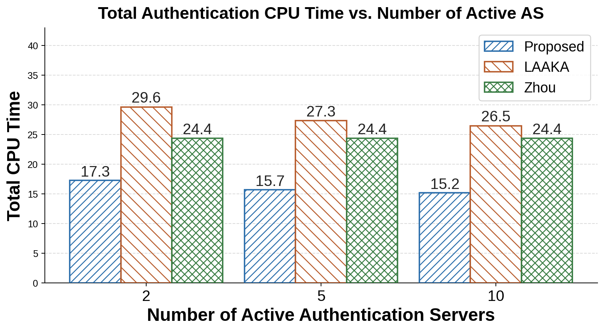
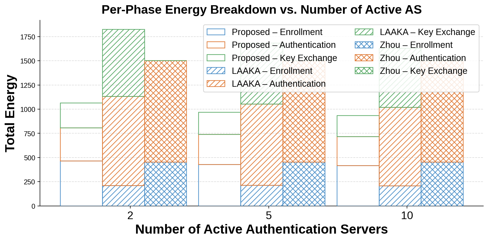
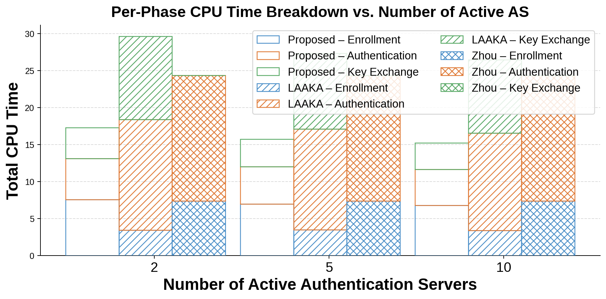
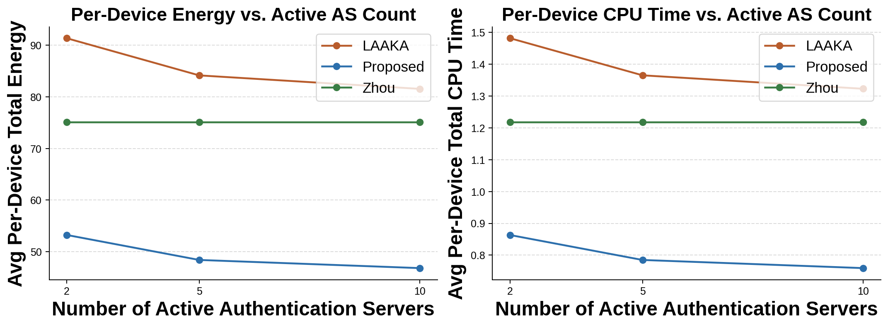

# Authenticator Variation Study — Summary

## Simulation Configuration

| Parameter | Value |
|---|---|
| Simulator | COOJA (Contiki-NG) |
| Mote type | TelosB (emulated) |
| Total devices | 20 IoT devices |
| Phases measured | Enrollment + Authentication + Key Exchange |
| Schemes compared | RA, LAAKA, Zhou |
| Active AS values tested | 2, 5, 10, 15 |
| Seeds per AS count | RA/LAAKA: 5; Zhou: 1 (95% CI from per-device variance) |

**What varies:** The number of active Authentication Servers (AS nodes) simultaneously available in the network. The gateway selects whichever AS it deems most suitable (decoupled AS selection). This study tests whether having more AS choices helps or hurts performance.

**Zhou's role in this chart:** Zhou uses a fixed gateway-coupled authentication model with no AS selection. Its bars are therefore constant across all AS counts and serve as a non-adaptive baseline. Data extracted from the existing 100-node COOJA simulation (seed 123456, 20 user devices, nodes 81–100). Zhou's Authentication phase includes key exchange (no separate Key Exchange phase).

---

## Key Numbers (from `as_variation_summary.csv`)

| Scheme | AS=2 | AS=5 | AS=10 | AS=15 |
|---|---|---|---|---|
| RA — Energy (mJ) | 1065 | 968 | 936 | 961 |
| LAAKA — Energy (mJ) | 1827 | 1683 | 1631 | 1662 |
| Zhou — Energy (mJ) | 1503 | 1503 | 1503 | 1503 |
| RA — CPU (s) | 17.3 | 15.7 | 15.2 | 15.6 |
| LAAKA — CPU (s) | 29.6 | 27.3 | 26.5 | 27.0 |
| Zhou — CPU (s) | 24.4 | 24.4 | 24.4 | 24.4 |

---

## Charts

### 01 — Total Authentication Energy vs. Number of Active AS

**Purpose:** Shows how total energy consumption (all 20 devices, all phases) changes as the number of available AS nodes increases from 2 to 15.

**Insight:**
- RA consistently consumes ~42% less energy than LAAKA and ~38% less than Zhou at every AS count.
- Both RA and LAAKA see a drop from AS=2 to AS=10 and then level off or slightly rise at AS=15, indicating an **optimal AS pool size of ~10** for this 20-device topology.
- Zhou's flat bars (1503 mJ across all AS counts) confirm it cannot benefit from AS selection — it is always outperformed by RA and beats LAAKA only when LAAKA's AS=2 configuration is used.
- RA's sweet spot is **AS=10 at 936 mJ**; LAAKA's is AS=10 at 1631 mJ; Zhou is fixed at 1503 mJ.

---

### 02 — Total Authentication CPU Time vs. Number of Active AS

**Purpose:** Same as chart 01 but for total CPU computation time across all 20 devices.

**Insight:**
- CPU time mirrors the energy trend exactly, confirming that energy and computation are tightly coupled.
- RA stays between 15.2–17.3 s; LAAKA varies from 26.5 s to 29.6 s; Zhou is flat at 24.4 s.
- Zhou falls between LAAKA and RA in CPU cost — better than LAAKA's unoptimised AS=2, but always worse than RA at any AS count ≥ 5.
- The RA–LAAKA gap (~12 s) and RA–Zhou gap (~9 s) remain constant, confirming RA's per-round cryptographic advantage is independent of topology.

---

### 03 — Per-Phase Energy Breakdown vs. Number of Active AS (Stacked Bar)

**Purpose:** Breaks the total energy in chart 01 into three segments — Enrollment (blue), Authentication (orange), Key Exchange (green) — for both RA (solid) and LAAKA (hatched).

**Insight:**
- In RA, the **Enrollment phase dominates** the total (roughly 45% of total energy), but it does not change with AS count since enrollment is a one-time event. Authentication and Key Exchange costs drop slightly as AS count increases from 2 to 10.
- In LAAKA, **Authentication dominates** (roughly 60% of LAAKA's total). LAAKA's enrollment is cheapest among its own phases but its auth+keyex is very heavy.
- This confirms that RA's advantage primarily comes from lighter authentication and key exchange rounds, not from enrollment efficiency.

---

### 04 — Per-Phase CPU Time Breakdown vs. Number of Active AS (Stacked Bar)

**Purpose:** Same phase breakdown as chart 03 but for CPU time.

**Insight:**
- Identical structural conclusion to chart 03 — RA's enrollment CPU is proportionally large, while LAAKA's authentication CPU dominates its total.
- The CPU breakdown confirms that Key Exchange is the second most expensive phase in LAAKA (hatched green occupies a large segment), whereas in RA it is the smallest phase.
- Both schemes show marginal improvement from AS=2 to AS=10 in their auth + keyex segments, suggesting more AS choices reduce contention or routing hops to the selected AS.

---

### 05 — Per-Device Energy and CPU Time vs. Active AS Count (Line Chart)

**Purpose:** Shows the **per-device average** (not total) for both energy (left panel) and CPU time (right panel) as AS count varies. Shaded bands show 95% CI.

**Insight:**
- The two curves (RA and LAAKA) are clearly separated with no overlap at any AS count — RA is always cheaper per device.
- Both curves are **convex** — they decrease from AS=2 to AS=10 and then flatten or rise slightly at AS=15. This is the clearest evidence that **10 active AS nodes is the practical optimum** for this 20-device topology.
- The tight confidence bands confirm results are statistically stable across the 5 seeds.
- **Paper claim supported:** The proposed decoupled AS selection mechanism benefits from a moderate number of AS candidates; diminishing returns set in beyond 10 AS nodes in a 20-device network.
