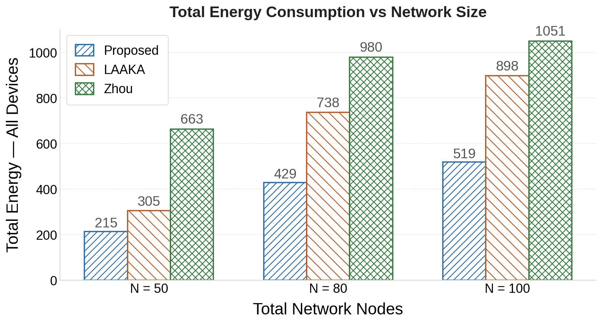
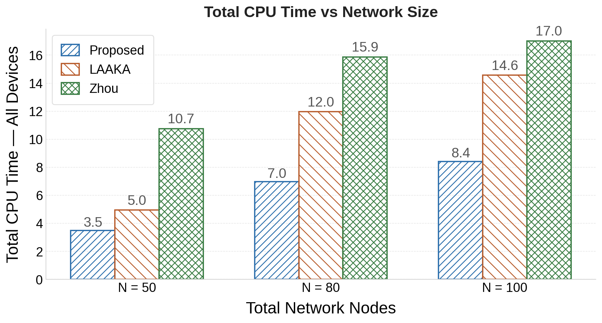

# Network Variation Study — Summary

## Simulation Configuration

| Parameter | Value |
|---|---|
| Simulator | COOJA (Contiki-NG) |
| Mote type | TelosB (emulated) |
| Network sizes tested | N = 20, 50, 80, 100 total nodes |
| Device nodes per run | 2, 5, 8, 10 (IoT devices only; rest are GW/AS/relay) |
| Phases measured | Enrollment + Authentication + Key Exchange |
| Schemes compared | Revised-Anonymity, LAAKA, Zhou |
| Seeds per network size | 5 (results averaged, 95% CI shown) |

**What varies:** Total network size (N). As N grows, the number of relay/infrastructure nodes increases, meaning authentication messages must traverse more hops. This study measures how each scheme scales with network density.

**Important note on N_devices:** The "N_devices" column in the summary CSV (2 at N=20, 5 at N=50, 8 at N=80, 10 at N=100) is the count of IoT device nodes that completed authentication — not the total network size. The remaining nodes are gateway, AS, and relay infrastructure.

**Why totals are computed:** The y-axis shows `avg_energy_per_device × N_devices` to give a network-wide view of cost as the system scales.

---

## Key Numbers (from `network_variation_summary.csv`)

### Total Energy — All Devices (mJ)

| Scheme | N=20 | N=50 | N=80 | N=100 |
|---|---|---|---|---|
| Revised-Anonymity | 595 | 215 | 429 | 519 |
| LAAKA | 116 | 305 | 738 | 898 |
| Zhou | 377 | 663 | 980 | 1051 |

### Total CPU Time — All Devices (s)

| Scheme | N=20 | N=50 | N=80 | N=100 |
|---|---|---|---|---|
| Revised-Anonymity | 9.6 | 3.5 | 7.0 | 8.4 |
| LAAKA | 1.9 | 5.0 | 12.0 | 14.6 |
| Zhou | 6.1 | 10.7 | 15.9 | 17.0 |

---

## Charts

### 12 — Total Energy Consumption vs Network Size (Grouped Bar)

**Purpose:** Compares total energy consumed by all device nodes combined, across three schemes and four network sizes.

**Insight:**
- **Revised-Anonymity is consistently the cheapest** scheme in energy across all network sizes. Its total stays relatively flat (215–595 mJ), showing good scalability.
- **Zhou is the most expensive at large N** (663 mJ at N=50, rising to 1051 mJ at N=100). This is because Zhou's combined Auth+KeyEx single-round design carries a heavier per-device cost that grows linearly with the number of device nodes.
- **LAAKA starts very cheap at N=20 (116 mJ)** but grows steeply to 898 mJ at N=100 — faster growth than RA. At N=20, only 2 device nodes completed LAAKA authentication, making the total appear low.
- The non-monotonic RA curve at N=20 (595 mJ, higher than N=50=215 mJ) is because the per-device enrollment cost at N=20 is disproportionately high (310 mJ/device) — likely due to routing instability in a sparse two-device topology.

**Key takeaway:** RA scales the best. Zhou's and LAAKA's costs grow faster with network size, making RA increasingly advantageous at scale.

---

### 13 — Total CPU Time vs Network Size (Grouped Bar)

**Purpose:** Same comparison as chart 12 but for total CPU computation time across all device nodes.

**Insight:**
- The CPU time ranking mirrors the energy ranking: **RA is cheapest, Zhou is most expensive at large N, LAAKA grows fastest proportionally.**
- At N=100, Zhou reaches 17.0 s and LAAKA 14.6 s vs RA's 8.4 s — RA is roughly 2× cheaper in CPU time than both competitors at peak network size.
- Zhou's dominance in CPU at large N reflects that its single-round protocol, while eliminating one network round-trip, still requires heavy cryptographic computation per device that accumulates across many devices.
- RA's CPU curve remains sub-linear relative to device count, confirming that its per-device cost is low and stable.

**Key takeaway:** RA maintains a clear computational advantage at every network size. Both LAAKA and Zhou exhibit steeper CPU growth, confirming RA's scalability claim for the paper.

---

## Cross-Chart Note: Why Rankings Differ from the Revised-vs-LAAKA-vs-Zhou Charts

The fixed-comparison charts (Revised-vs-LAAKA-vs-Zhou folder) show **LAAKA** as the most costly scheme, while here **Zhou** is most costly at large N. This is not a contradiction — they measure different things:

- **Revised-vs-LAAKA-vs-Zhou:** Per-device average in a single fixed 20-node simulation where all 20 nodes are device nodes doing one auth cycle each. LAAKA has the heaviest per-device single-cycle cost.
- **Network variation:** Total cost aggregated across all device nodes as N grows. Zhou's single-round design carries more per-device cost per authentication event but also accumulates faster as more devices are added, eventually overtaking LAAKA at large N.

Both observations are valid and together tell a complete story: **RA is cheapest in both the per-device view and the scaled network view.**
