# Revised-Anonymity vs LAAKA vs Zhou — Fixed Comparison Summary

## Simulation Configuration

| Parameter | Value |
|---|---|
| Simulator | COOJA (Contiki-NG) |
| Mote type | TelosB (emulated) |
| Total devices | 20 IoT device nodes |
| Topology | Fixed 20-node network (all nodes are authenticating devices) |
| Phases measured | Enrollment, Authentication, Key Exchange (per phase and combined) |
| Schemes compared | Revised-Anonymity (RA), LAAKA, Zhou |
| Seeds | 5 per scheme (results averaged, 95% CI shown) |
| Error bars | 95% Confidence Interval = 1.96 × std / √n |

**What this study measures:** A direct head-to-head comparison of the three schemes under identical simulation conditions. Every device in the 20-node network completes one full cycle of all applicable phases. Results are reported as per-device averages with statistical confidence.

**Zhou note:** Zhou combines Authentication and Key Exchange into a single round. It therefore has no separate Key Exchange phase; charts show its Auth column as the combined Auth+KeyEx cost.

---

## Key Numbers (from `comparison_summary.csv`)

### Energy (mJ per device, mean ± 95% CI, n=20)

| Phase | Revised-Anonymity | LAAKA | Zhou |
|---|---|---|---|
| Enrollment | 23.33 ± 1.82 | 13.25 ± 1.35 | 22.76 ± 1.63 |
| Authentication | 16.17 ± 1.17 | 44.48 ± 2.84 | 57.06 ± 4.84 |
| Key Exchange | 12.70 ± 1.40 | 33.49 ± 2.21 | — |
| **Auth + KeyEx** | **28.87 ± 2.24** | **77.97 ± 5.03** | **57.06 ± 4.84** |
| **Total (all phases)** | **52.21** | **91.22** | **79.81** |

### CPU Time (s per device)

| Phase | Revised-Anonymity | LAAKA | Zhou |
|---|---|---|---|
| Enrollment | 0.378 | 0.215 | — |
| Authentication | 0.262 | 0.721 | 0.924 |
| Key Exchange | 0.206 | 0.543 | — |
| **Total** | **0.847** | **1.479** | **0.924** |

---

## Charts

### 01 — Enrollment Phase Energy

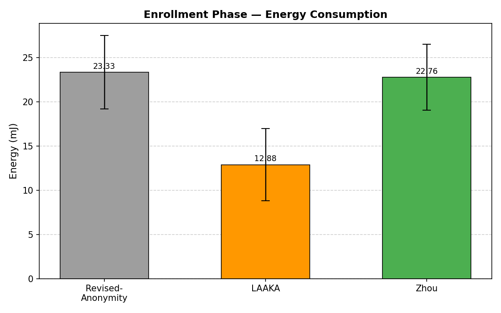

**Purpose:** Per-device mean energy consumed during the one-time enrollment phase.

**Insight:** LAAKA has the cheapest enrollment (13.25 mJ) because it uses a simpler initial credential exchange. RA (23.33 mJ) and Zhou (22.76 mJ) are comparable — both carry the overhead of PUF challenge-response or initial credential binding. Enrollment is a one-time cost; its weight is lower in long-running deployments.

---

### 02 — Authentication Phase Energy

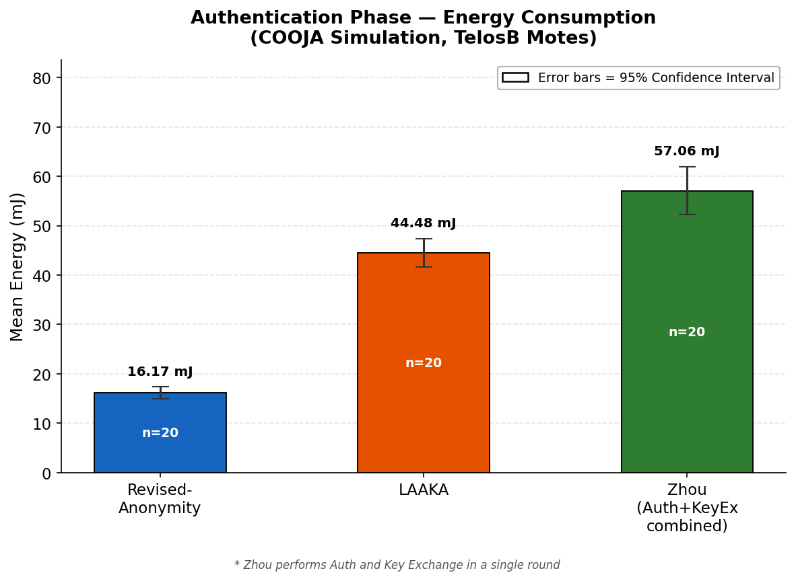

**Purpose:** Per-device mean energy for the authentication round. Zhou's bar represents its combined Auth+KeyEx cost.

**Insight:** RA's authentication (16.17 mJ) is the cheapest by a large margin — roughly 2.7× lower than LAAKA (44.48 mJ) and 3.5× lower than Zhou (57.06 mJ combined). RA's compact pseudonym-based messages (PID = H(ID_D ‖ m_curr)) keep per-round payload small, directly reducing radio-on time.

---

### 03 — Key Exchange Phase Energy

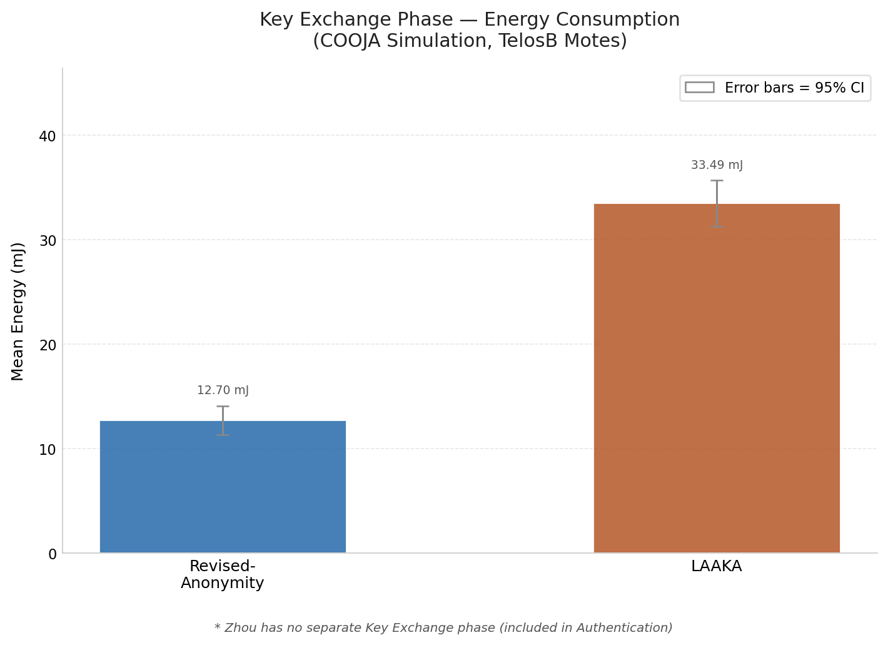

**Purpose:** Per-device mean energy for the key exchange round. Zhou is absent (no separate phase).

**Insight:** RA's key exchange (12.70 mJ) is ~38% cheaper than LAAKA's (33.49 mJ). This reinforces that RA's two-round protocol carries lighter payload in both rounds, not just authentication.

---

### 04 — Auth + Key Exchange Combined Energy

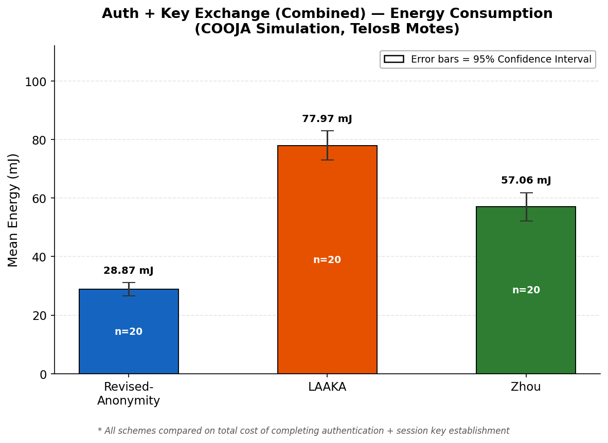

**Purpose:** Apples-to-apples comparison of the total cost of authenticating and establishing a session key, regardless of how many protocol rounds each scheme uses.

**Insight:** RA (28.87 mJ) saves **63% over LAAKA** (77.97 mJ) and **49% over Zhou** (57.06 mJ) for the auth+keyex combined cost. This is the most directly comparable metric across schemes and the one most relevant to the paper's claimed 26.8% overhead reduction (measured in bytes; the energy saving is larger because radio energy scales super-linearly with payload size).

---

### 05 — Grouped Energy: All Phases, All Schemes

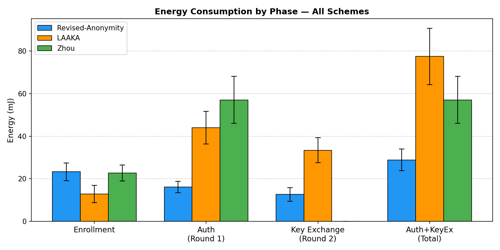

**Purpose:** Side-by-side bars for every phase and every scheme in one chart, showing how each phase contributes to each scheme's profile.

**Insight:** The grouped view makes the phase-level imbalance clear. LAAKA's authentication bar alone (~44 mJ) exceeds RA's entire three-phase total in the Auth+KeyEx combined column. Zhou has a single dominant auth bar. RA is the only scheme where all three individual phases stay below 25 mJ each.

---

### 06 — Grouped CPU Time: All Phases, All Schemes

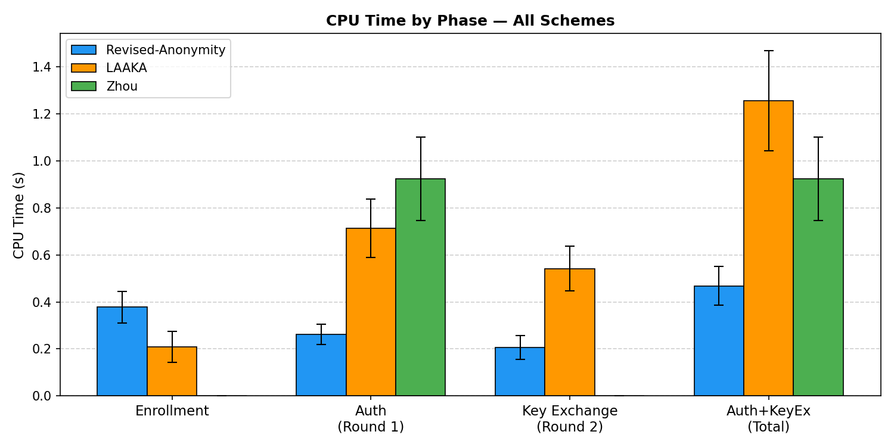

**Purpose:** Same structure as chart 05 but for CPU computation time.

**Insight:** CPU trends mirror energy trends. RA's total CPU (0.847 s) is less than LAAKA's authentication CPU alone (0.721 s). Zhou's auth CPU (0.924 s) also exceeds RA's entire total, confirming RA's computational lightness is consistent across all phases.

---

### 07 — Per-Device Auth+KeyEx Energy Line Chart

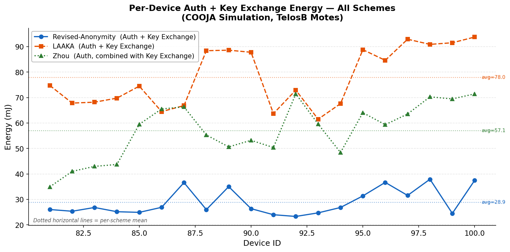

**Purpose:** Shows the Auth+KeyEx energy for each individual device (by Device ID), not just the average. Dotted horizontal lines mark per-scheme means.

**Insight:** RA's per-device values (blue) are tightly clustered around their mean (~28.9 mJ) with low variance, indicating consistent performance across devices. LAAKA and Zhou show wider spread, meaning some devices pay significantly more than the average — a reliability concern in energy-constrained deployments. RA is both cheaper on average and more predictable.

---

### 08 — Combined Energy Cost Per Device (Stacked Bar)

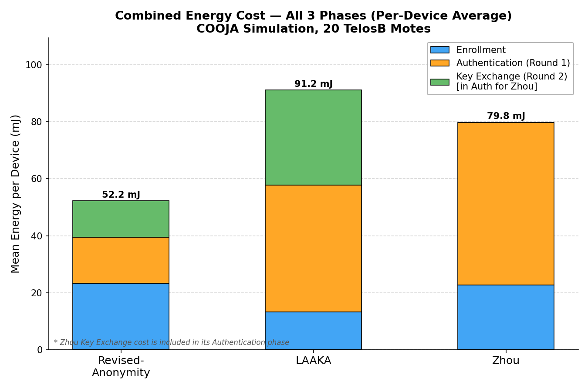

**Purpose:** Stacked bar showing per-device average energy for all three phases combined, with phase-level colour coding (blue=Enrollment, orange=Auth, green=KeyEx).

**Insight:** RA's total stacked bar (52.21 mJ) is visibly the shortest. The proportion of auth+keyex in RA's total is smaller than in LAAKA or Zhou, meaning RA achieves a better phase balance. Zhou's bar is dominated almost entirely by its single auth segment.

---

### 09 — All-Nodes Combined Energy (Stacked Bar)

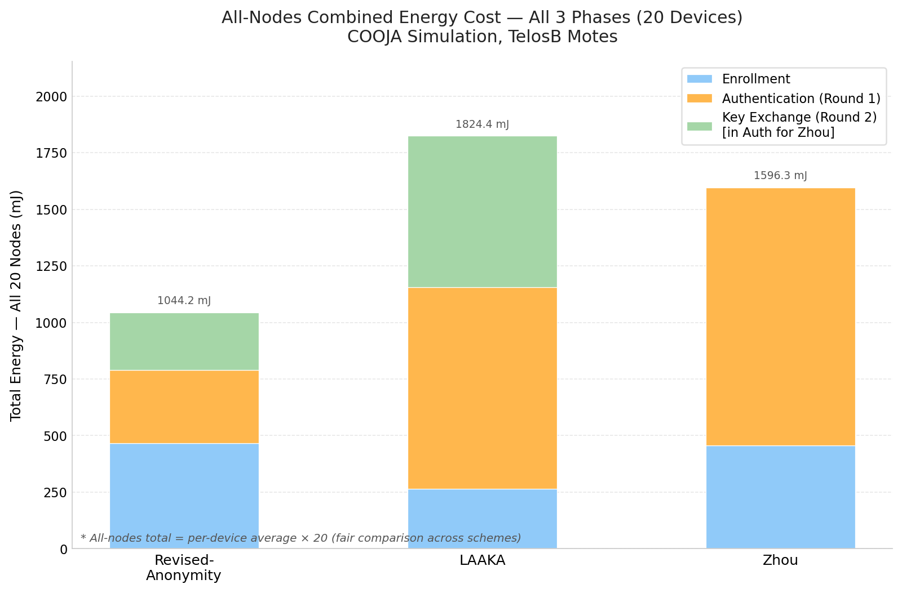

**Purpose:** Same as chart 08 but scaled to the full 20-node network (per-device average × 20).

**Insight:** At the network level, RA consumes ~1044 mJ total vs ~1824 mJ for LAAKA and ~1596 mJ for Zhou. The 20× multiplication preserves all relative rankings. This chart is most relevant when estimating total battery life for a deployed network.

---

### 10 — Per-Device Combined Energy Line Chart

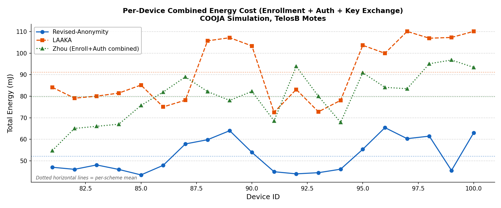

**Purpose:** Plots each device's total (Enrollment + Auth + KeyEx) energy individually, with horizontal dotted lines at the per-scheme mean.

**Insight:** Variance in RA (blue) is visibly lower than in LAAKA and Zhou. This per-device view confirms that RA not only achieves a lower mean but also tighter distribution — important for worst-case energy budgeting in real deployments.

---

### 11 — Grouped Per-Phase and Combined Energy

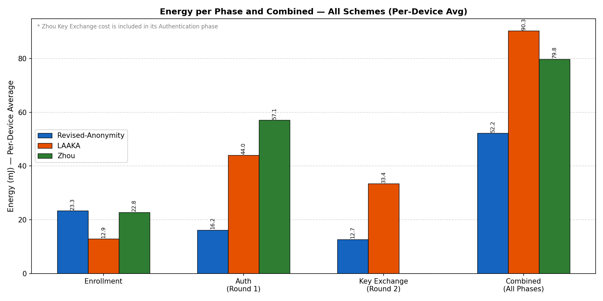

**Purpose:** Places all three schemes side-by-side for each individual phase column and a combined column.

**Insight:** The combined column (rightmost group) summarises the full picture: RA is cheapest, Zhou is middle, LAAKA is most expensive in per-device total. The individual phase columns explain why: RA's advantage is driven primarily by the auth and key exchange rounds, not by enrollment.

---

### 12 — All-Nodes Combined Energy (Simple Bar)

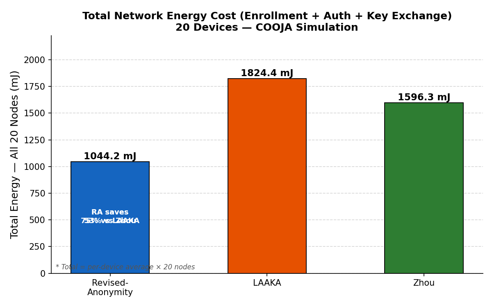

**Purpose:** A single simplified bar chart showing total network energy across all phases for each scheme.

**Insight:** Directly shows RA saves ~42.8% over LAAKA and ~34.6% over Zhou at the network level. Annotations inside bars show the saving percentage. This is the summary chart most suitable for a paper figure.

---

### 13 — Combined CPU Time Per Device (Stacked Bar)

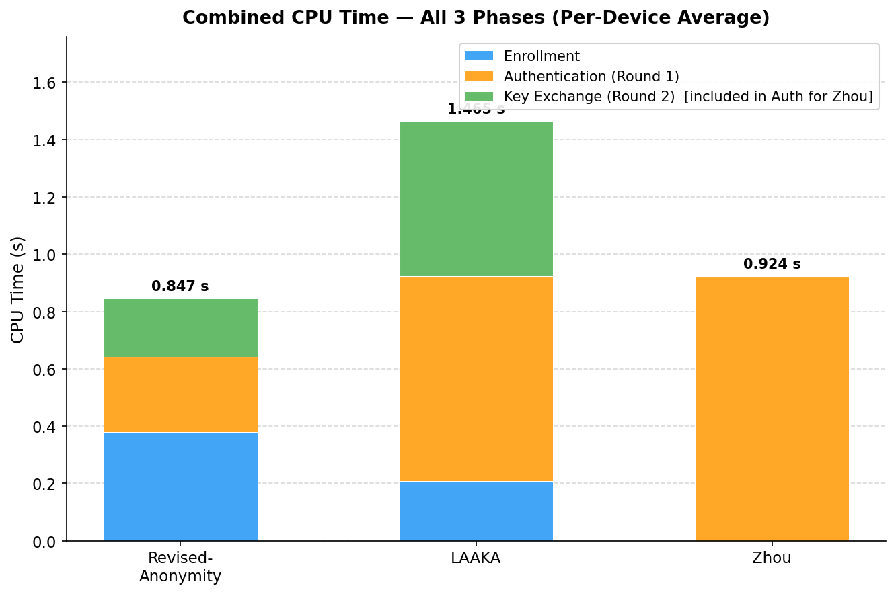

**Purpose:** Per-device average CPU time broken down by phase (stacked).

**Insight:** RA's per-device CPU total (0.847 s) is well below LAAKA (1.479 s) and Zhou (0.924 s). The auth phase is the dominant CPU consumer for LAAKA and Zhou, while RA distributes computation more evenly across phases.

---

### 14 — All-Nodes Combined CPU Time (Stacked Bar)

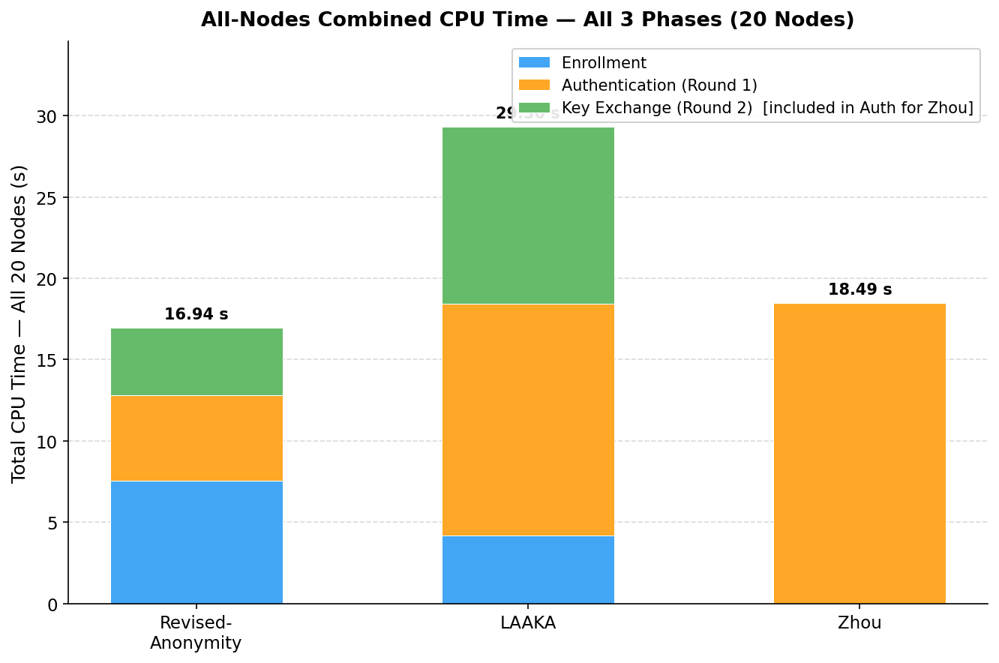

**Purpose:** Same as chart 13 but scaled to all 20 nodes.

**Insight:** Total network CPU for RA is ~16.9 s vs ~29.6 s for LAAKA and ~18.5 s for Zhou. LAAKA's high total is driven by its heavy per-device CPU cost in both auth and key exchange.

---

### 15 — Per-Device Combined CPU Time Line Chart

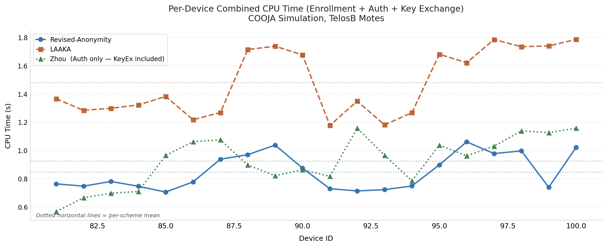

**Purpose:** Per-device CPU time scatter with scheme means marked by dotted lines.

**Insight:** RA's per-device CPU values are tightly grouped (low variance). LAAKA and Zhou show higher spread across devices. Consistent with the energy per-device chart (07, 10), RA offers both lower mean and more predictable behaviour.

---

### 16 — Grouped Per-Phase and Combined CPU Time

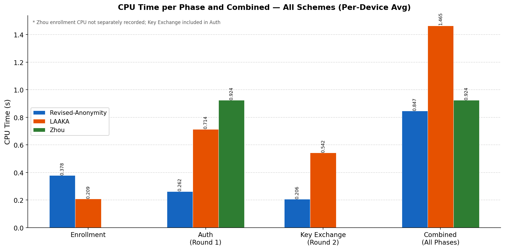

**Purpose:** All three schemes compared per-phase and combined, for CPU time.

**Insight:** RA's auth CPU (0.262 s) is less than one-third of LAAKA's auth CPU (0.721 s) and less than one-third of Zhou's (0.924 s). The key exchange column shows LAAKA also spending more than RA there (0.543 s vs 0.206 s). RA's advantage holds in every individual phase.

---

### 17 — All-Nodes Combined CPU Time (Simple Bar)

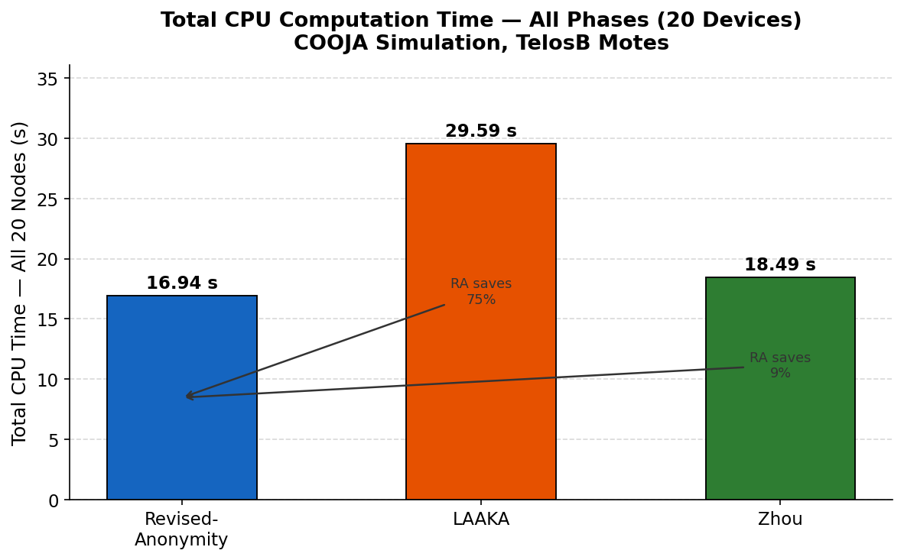

**Purpose:** Simplified total CPU bar for each scheme, scaled to 20 nodes.

**Insight:** Mirrors chart 12 for CPU. RA saves ~42.8% CPU time over LAAKA and ~8.5% over Zhou at network scale. CPU savings are smaller against Zhou than energy savings because Zhou's single combined round, while energy-heavy, does not require extra CPU for a second protocol round.

---

### 18 — Per-Device Mean Total Cost — All Phases (Dual-Panel)

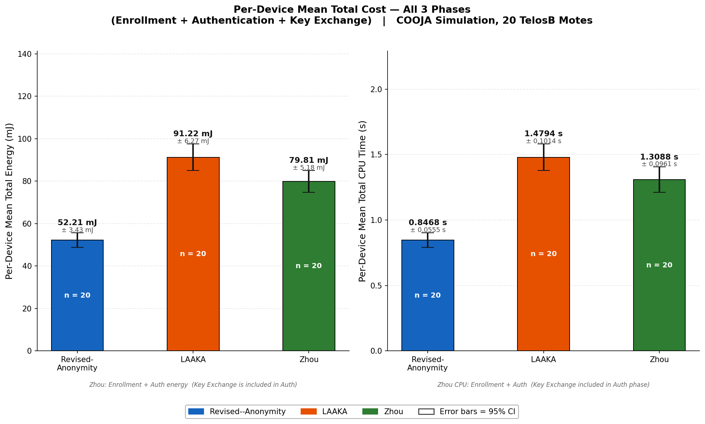

**Purpose:** The primary summary chart. Two panels — energy (left) and CPU (right) — each showing per-device mean with 95% CI error bars and ± CI values labelled.

**Insight:**
- **Energy:** RA = 52.21 mJ, Zhou = 79.81 mJ, LAAKA = 91.22 mJ. RA is cheapest by a clear margin with narrow CI bands confirming statistical reliability.
- **CPU:** RA = 0.847 s, Zhou = 1.309 s, LAAKA = 1.479 s. Same ranking.
- LAAKA is the most costly scheme on both metrics in this per-device fixed-topology view, driven by its heavy authentication and key exchange rounds.
- This chart is the most suitable single figure for the paper's performance evaluation section as it shows both metrics side by side with proper statistical confidence.
